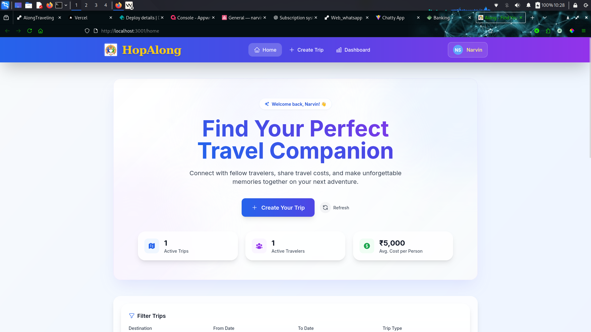
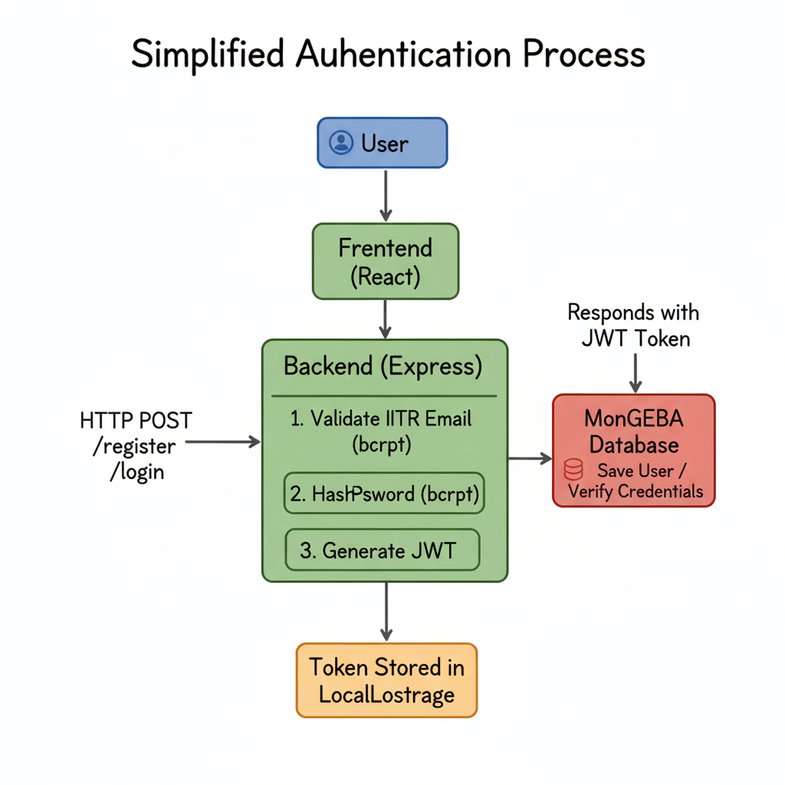
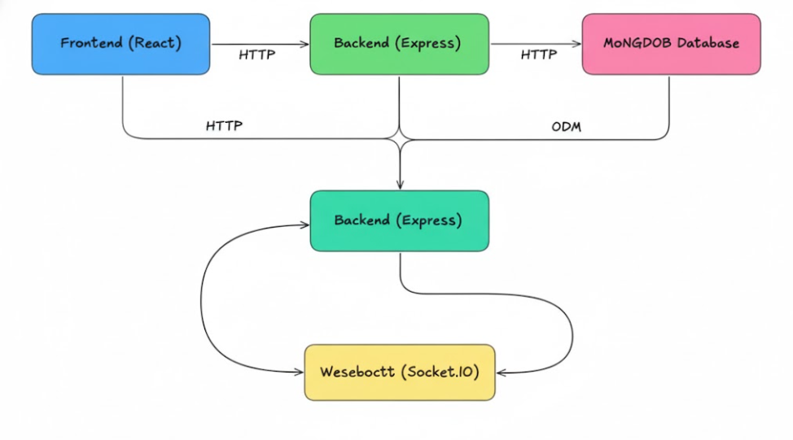

# HopAlong

**Your Travel Companion Platform**

### ⚙️ Tech Stack

<div style="display:flex; flex-wrap:wrap; gap:12px; justify-content:center; margin:18px auto 8px; max-width:860px;">
  <span style="display:inline-flex; align-items:center; gap:8px; padding:10px 16px; border-radius:14px; background:rgba(255,255,255,0.18); border:1px solid rgba(255,255,255,0.35); font-weight:600;">
     React 18
  </span>
  <span style="display:inline-flex; align-items:center; gap:8px; padding:10px 16px; border-radius:14px; background:rgba(255,255,255,0.18); border:1px solid rgba(255,255,255,0.35); font-weight:600;">
     Vite
  </span>
  <span style="display:inline-flex; align-items:center; gap:8px; padding:10px 16px; border-radius:14px; background:rgba(255,255,255,0.18); border:1px solid rgba(255,255,255,0.35); font-weight:600;">
     Tailwind CSS
  </span>
  <span style="display:inline-flex; align-items:center; gap:8px; padding:10px 16px; border-radius:14px; background:rgba(255,255,255,0.18); border:1px solid rgba(255,255,255,0.35); font-weight:600;">
     Node.js
  </span>
  <span style="display:inline-flex; align-items:center; gap:8px; padding:10px 16px; border-radius:14px; background:rgba(255,255,255,0.18); border:1px solid rgba(255,255,255,0.35); font-weight:600;">
     Express.js
  </span>
  <span style="display:inline-flex; align-items:center; gap:8px; padding:10px 16px; border-radius:14px; background:rgba(255,255,255,0.18); border:1px solid rgba(255,255,255,0.35); font-weight:600;">
     MongoDB & Mongoose
  </span>
  <span style="display:inline-flex; align-items:center; gap:8px; padding:10px 16px; border-radius:14px; background:rgba(255,255,255,0.18); border:1px solid rgba(255,255,255,0.35); font-weight:600;">
     Socket.IO
  </span>
  <span style="display:inline-flex; align-items:center; gap:8px; padding:10px 16px; border-radius:14px; background:rgba(255,255,255,0.18); border:1px solid rgba(255,255,255,0.35); font-weight:600;">
     JWT Auth
  </span>
  <span style="display:inline-flex; align-items:center; gap:8px; padding:10px 16px; border-radius:14px; background:rgba(255,255,255,0.18); border:1px solid rgba(255,255,255,0.35); font-weight:600;">
     Axios + Interceptors
  </span>
  <span style="display:inline-flex; align-items:center; gap:8px; padding:10px 16px; border-radius:14px; background:rgba(255,255,255,0.18); border:1px solid rgba(255,255,255,0.35); font-weight:600;">
     DevOps Tooling
  </span>
</div>

### ✨ Feature Highlights

- Collaborative trip planning with advanced filters and smart search
- Secure auth with token storage, profile management, and statistics tracking
- Real-time chat, typing indicators, and request notifications via Socket.IO
- Glassmorphism UI, responsive layouts, skeleton loaders, and rich toasts


[](https://alontraveling.netlify.app/ "Open the live HopAlong experience")

HopAlong is a comprehensive web application designed to connect travelers for shared journeys. The platform enables users to discover travel companions, organize trips, manage join requests, and communicate in real-time through an intuitive and secure interface.

---

## Table of Contents

- [Overview](#overview)
- [Key Features](#key-features)
- [Technology Stack](#technology-stack)
- [Architecture](#architecture)
- [Getting Started](#getting-started)
- [Project Structure](#project-structure)
- [API Documentation](#api-documentation)
- [Authentication Flow](#authentication-flow)
- [Real-time Features](#real-time-features)
- [Security](#security)
- [Deployment](#deployment)
- [Contributing](#contributing)
- [License](#license)

---

## Overview

HopAlong solves the common challenge faced by IITR students who want to travel but lack companions or find it difficult to coordinate group trips. The platform provides a centralized hub where students can:

- Browse available trips posted by fellow students
- Create and manage their own trips
- Request to join trips that match their interests
- Communicate with trip participants through integrated chat
- Track their travel history and manage their profile

The application enforces IITR email authentication to ensure a trusted, campus-only community.



---

## Key Features

### User Management
- **Secure Registration**: IITR email validation with support for departmental subdomains
- **JWT Authentication**: Token-based authentication with secure password hashing
- **Profile Management**: Update personal information, branch, year, and bio
- **User Statistics**: Track trips created and joined

### Trip Management
- **Trip Creation**: Comprehensive trip details including destination, dates, budget, mode, and type
- **Advanced Filtering**: Filter trips by destination, dates, travel mode, and trip type
- **Search Functionality**: Quick search across trip titles, descriptions, and destinations
- **Seat Management**: Automatic participant tracking and capacity limits
- **Trip Ownership**: Organizers can edit and delete their own trips

### Join Request System
- **Request Workflow**: Send personalized join requests with messages
- **Approval System**: Trip organizers can approve or reject requests
- **Status Tracking**: Monitor request status (pending, approved, rejected)
- **Duplicate Prevention**: System prevents multiple requests to the same trip
- **Automatic Updates**: Participant counts update automatically upon approval

### Real-time Communication
- **Group Chat**: Socket.IO powered real-time messaging for trip participants
- **Typing Indicators**: See when other participants are typing
- **Message History**: Persistent chat history for each trip
- **Participant-Only Access**: Chat restricted to approved trip members

### User Interface
- **Responsive Design**: Optimized for desktop, tablet, and mobile devices
- **Modern Aesthetics**: Glass-morphism effects and gradient accents
- **Smooth Animations**: Page transitions and micro-interactions
- **Toast Notifications**: Real-time feedback for user actions
- **Loading States**: Professional skeleton loaders and loading indicators

---

## Technology Stack

### Frontend
- **Framework**: React 18 with Vite build tool
- **Routing**: React Router v6 for navigation
- **State Management**: Zustand with localStorage persistence
- **Styling**: TailwindCSS for utility-first styling
- **HTTP Client**: Axios with request/response interceptors
- **Real-time**: Socket.IO client for live updates
- **Icons**: Heroicons for consistent iconography

### Backend
- **Runtime**: Node.js with Express.js framework
- **Database**: MongoDB with Mongoose ODM
- **Authentication**: JWT (JSON Web Tokens)
- **Real-time**: Socket.IO server for WebSocket connections
- **Security**: Helmet, bcryptjs, express-rate-limit
- **Validation**: express-validator for input sanitization
- **Logging**: Morgan for request logging


## Architecture

### System Architecture



### Data Flow

1. **Authentication**: User registers/logs in → Backend validates IITR email → JWT token issued → Token stored in localStorage
2. **Trip Browsing**: Frontend fetches trips → Backend queries MongoDB → Filtered results returned
3. **Join Request**: User sends request → Backend validates → Database updated → Notification sent via Socket.IO
4. **Real-time Chat**: Message sent → Socket.IO broadcasts → All participants receive update instantly

### Database Schema

**Users Collection**
- Personal information (name, email, branch, year, bio)
- Password (hashed with bcrypt)
- References to created trips and joined trips
- Avatar initials auto-generated from name

**Trips Collection**
- Trip details (title, destination, dates, budget)
- Organizer reference
- Participant references array
- Status tracking (upcoming, ongoing, completed)

**Join Requests Collection**
- User and trip references
- Request message
- Status (pending, approved, rejected)
- Timestamps

**Messages Collection**
- Trip and sender references
- Message content
- Read status tracking

---

## Getting Started

### Prerequisites

- **Node.js**: Version 14 or higher (recommended v16+)
- **MongoDB**: Local installation or MongoDB Atlas account
- **npm**: Package manager (comes with Node.js)
- **Git**: Version control (for cloning repository)

### Installation

**1. Clone the repository**
```bash
git clone https://github.com/your-username/HopAlong.git
cd HopAlong
```

*Note: Replace with your actual repository URL*

**2. Backend Setup**
```bash
cd backend
npm install
```

Create `.env` file in backend directory:
```env
PORT=5000
NODE_ENV=development
MONGODB_URI=mongodb://localhost:27017/hopalong
JWT_SECRET=your-super-secret-jwt-key-change-this-in-production
JWT_EXPIRE=30d
FRONTEND_URL=http://localhost:3000
```

**3. Frontend Setup**
```bash
cd ../frontend
npm install
```

Create `.env` file in frontend directory:
```env
VITE_API_BASE_URL=http://localhost:5000/api
```

**4. Seed Database (Optional)**
```bash
cd ../backend
npm run seed
```
This creates 6 demo users and 10 sample trips.

**5. Start the Application**

Open two terminal windows:

**Terminal 1 - Backend:**
```bash
cd backend
npm run dev
```
Server starts on http://localhost:5000

**Terminal 2 - Frontend:**
```bash
cd frontend
npm run dev
```
Application opens on http://localhost:3000

---

## Project Structure

### Root Directory
```
HopAlong/
├── frontend/             # React frontend application
├── backend/              # Express backend API
├── README.md             # Root documentation (this file)
└── package.json          # Workspace metadata (if using npm workspaces)
```

### Frontend Structure (`frontend/`)
```
frontend/
├── src/
│   ├── api/               # API client and endpoints
│   │   ├── api.js             # API methods
│   │   ├── client.js          # Axios configuration
│   │   ├── config.js          # API settings and token helpers
│   │   └── socket.js          # Socket.IO client setup
│   ├── assets/            # Static assets (images, icons)
│   ├── components/        # Reusable UI components
│   │   ├── Header.jsx
│   │   ├── Footer.jsx
│   │   ├── TripCard.jsx
│   │   ├── TripForm.jsx
│   │   ├── ChatPanel.jsx
│   │   ├── FiltersBar.jsx
│   │   ├── RequestModal.jsx
│   │   ├── RequestsList.jsx
│   │   ├── Badge.jsx
│   │   ├── ErrorBoundary.jsx
│   │   └── NotificationToast.jsx
│   ├── hooks/             # Custom React hooks
│   ├── lib/               # Utility helpers
│   ├── routes/            # Page-level components
│   │   ├── Login.jsx
│   │   ├── Register.jsx
│   │   ├── Home.jsx
│   │   ├── TripDetail.jsx
│   │   ├── CreateTrip.jsx
│   │   ├── Dashboard.jsx
│   │   ├── Profile.jsx
│   │   └── NotFound.jsx
│   ├── store/             # Zustand state management
│   │   └── useStore.js
│   ├── App.jsx            # Root React component
│   ├── index.css          # Global styles
│   └── main.jsx           # Application entry point
├── public/                # Static public assets (if any)
├── package.json
├── README.md
└── vite.config.js
```

### Backend Structure (`backend/`)
```
backend/
├── config/
│   └── db.js               # MongoDB connection
├── controllers/            # Request handlers
│   ├── authController.js
│   ├── messageController.js
│   ├── requestController.js
│   ├── tripController.js
│   └── userController.js
├── middleware/             # Custom middleware
│   ├── auth.js
│   ├── errorHandler.js
│   └── validation.js
├── models/                 # Mongoose schemas
│   ├── JoinRequest.js
│   ├── Message.js
│   ├── Trip.js
│   └── User.js
├── routes/                 # API route definitions
│   ├── auth.js
│   ├── messages.js
│   ├── requests.js
│   ├── trips.js
│   └── users.js
├── seeders/
│   └── seedData.js         # Database seeding script
├── utils/
│   ├── emailValidator.js
│   └── generateToken.js
├── uploads/                # File upload directory (placeholder)
├── package.json
├── README.md
├── server.js               # Express server entry point
└── .env.example            # Environment variable template
```

---

## API Documentation

### Base URL
```
http://localhost:5000/api
```

### Authentication Endpoints

| Method | Endpoint                  | Description          | Access  |
|--------|---------------------------|----------------------|---------|
| POST   | `/auth/register`          | Register new user    | Public  |
| POST   | `/auth/login`             | Login user           | Public  |
| GET    | `/auth/me`                | Get current user     | Private |
| POST   | `/auth/logout`            | Logout user          | Private |
| PUT    | `/auth/updatepassword`    | Update password      | Private |

### Trip Endpoints

| Method | Endpoint           | Description              | Access           |
|--------|--------------------|--------------------------|------------------|
| GET    | `/trips`           | Get all trips (filtered) | Public           |
| GET    | `/trips/:id`       | Get single trip          | Public           |
| POST   | `/trips`           | Create new trip          | Private          |
| PUT    | `/trips/:id`       | Update trip              | Private (Owner)  |
| DELETE | `/trips/:id`       | Delete trip              | Private (Owner)  |

**Query Parameters for GET /trips:**
- `destination` - Filter by destination
- `startDate` - Filter by start date
- `endDate` - Filter by end date
- `mode` - Travel mode (Bus, Train, Car, Flight)
- `type` - Trip type (Adventure, Leisure, Cultural, Educational)
- `status` - Trip status (upcoming, ongoing, completed)
- `search` - Search term
- `page` - Page number (default: 1)
- `limit` - Results per page (default: 10)

### Join Request Endpoints

| Method | Endpoint                     | Description        | Access           |
|--------|------------------------------|--------------------|------------------|
| POST   | `/requests`                  | Send join request  | Private          |
| GET    | `/requests/trip/:tripId`     | Get trip requests  | Private (Owner)  |
| GET    | `/requests/user/:userId`     | Get user requests  | Private (Self)   |
| PUT    | `/requests/:id/approve`      | Approve request    | Private (Owner)  |
| PUT    | `/requests/:id/reject`       | Reject request     | Private (Owner)  |
| DELETE | `/requests/:id`              | Cancel request     | Private (Self)   |

### Message Endpoints

| Method | Endpoint                  | Description          | Access                |
|--------|---------------------------|----------------------|-----------------------|
| GET    | `/messages/trip/:tripId`  | Get trip messages    | Private (Participant) |
| POST   | `/messages`               | Send message         | Private (Participant) |
| DELETE | `/messages/:id`           | Delete message       | Private (Sender)      |

### User Endpoints

| Method | Endpoint                         | Description           | Access         |
|--------|----------------------------------|-----------------------|----------------|
| GET    | `/users/:id`                     | Get user profile      | Public         |
| PUT    | `/users/:id`                     | Update user profile   | Private (Self) |
| GET    | `/users/:id/trips`               | Get user's trips      | Public         |
| GET    | `/users/:id/participations`      | Get joined trips      | Public         |
| GET    | `/users/:id/stats`               | Get user statistics   | Public         |

---

## Authentication Flow


### Registration
1. User submits registration form with IITR email
2. Backend validates email format (*.iitr.ac.in)
3. Password is hashed using bcrypt (10 salt rounds)
4. User document created in MongoDB
5. JWT token generated and returned
6. Frontend stores token in localStorage
7. User automatically logged in

### Login
1. User submits email and password
2. Backend normalizes email (lowercase, trim)
3. User retrieved from database with password field
4. Password compared using bcrypt
5. JWT token generated on successful match
6. Token returned and stored in frontend
7. Socket.IO connection established

### Protected Routes
- Frontend checks authentication state before rendering
- Axios interceptor attaches JWT to all requests
- Backend middleware verifies token
- Invalid/expired tokens trigger logout

---

## Real-time Features

### Socket.IO Events

**Client Events**
- `user:join` - User connects with their ID
- `trip:join` - Join trip room
- `trip:leave` - Leave trip room
- `message:send` - Send message
- `typing:start` - User starts typing
- `typing:stop` - User stops typing

**Server Events**
- `message:new` - New message broadcast
- `user:typing` - Typing indicator
- `user:joined` - User joined trip
- `user:left` - User left trip
- `request:notification` - New join request
- `request:status-update` - Request approved/rejected

### Connection Management
- Automatic reconnection on disconnect
- User-socket mapping for targeted notifications
- Room-based messaging for trip isolation

---

## Security

### Implementation

**Password Security**
- Bcrypt hashing with 10 salt rounds
- Passwords never returned in API responses
- Password reset functionality (updatePassword endpoint)

**JWT Tokens**
- Signed with secret key
- 30-day expiration by default
- Stored in localStorage (consider httpOnly cookies for production)
- Automatic cleanup on logout

**Input Validation**
- express-validator for all inputs
- IITR email domain enforcement
- XSS prevention through sanitization
- SQL/NoSQL injection prevention via Mongoose

**Rate Limiting**
- 100 requests per 10 minutes per IP
- Prevents brute force attacks
- Applied to all API endpoints

**CORS**
- Configured allowed origins
- Credentials support enabled
- Prevents unauthorized access

**HTTP Security Headers**
- Helmet middleware for security headers
- Content Security Policy
- XSS Protection
- HSTS enabled

---

## Deployment

### Production Checklist

**Backend**
- [ ] Set `NODE_ENV=production`
- [ ] Use strong `JWT_SECRET` (minimum 32 characters)
- [ ] Configure MongoDB Atlas or production database
- [ ] Enable HTTPS
- [ ] Set proper CORS origins
- [ ] Configure logging and monitoring
- [ ] Use process manager (PM2)
- [ ] Set up database backups

**Frontend**
- [ ] Update `VITE_API_BASE_URL` to production API
- [ ] Build optimized production bundle
- [ ] Configure CDN for static assets
- [ ] Enable HTTPS
- [ ] Set up error tracking (e.g., Sentry)
- [ ] Configure analytics

**Infrastructure**
- [ ] Use reverse proxy (Nginx)
- [ ] Set up SSL certificates
- [ ] Configure firewall rules
- [ ] Set up monitoring and alerts
- [ ] Configure backup strategy

### Recommended Platforms

**Frontend**: Vercel, Netlify, AWS S3 + CloudFront
**Backend**: Heroku, DigitalOcean, AWS EC2, Railway
**Database**: MongoDB Atlas

---

## Testing

### Manual Testing Workflow

**Authentication**
1. Register with IITR email (test subdomain support)
2. Verify automatic login after registration
3. Logout and login with same credentials
4. Test invalid email formats

**Trip Management**
1. Create a trip with all required fields
2. Edit trip details (owner only)
3. Filter trips by various criteria
4. Search for trips by keyword
5. Delete trip (owner only)

**Join Requests**
1. Send join request with message
2. Verify organizer receives notification
3. Approve/reject request
4. Check participant list updates
5. Test duplicate request prevention

**Chat**
1. Join approved trip
2. Send messages
3. Verify real-time delivery
4. Test typing indicators
5. Check message persistence

---

## **Demo Credentials**

After running `npm run seed` in the backend directory, use any of these test accounts:

- `rahul.sharma@iitr.ac.in` / `password123` (CSE, 3rd Year)
- `priya.patel@iitr.ac.in` / `password123` (ECE, 2nd Year)
- `arjun.kumar@iitr.ac.in` / `password123` (Mechanical, 4th Year)
- `sneha.reddy@iitr.ac.in` / `password123` (Civil, 3rd Year)
- `vikram.singh@iitr.ac.in` / `password123` (Chemical, 2nd Year)
- `ananya.gupta@iitr.ac.in` / `password123` (Architecture, 1st Year)

All seeded users share the same password for testing convenience.

---

## Contributing

1. Fork the repository
2. Create a feature branch (`git checkout -b feature/YourFeature`)
3. Commit changes (`git commit -m 'Add YourFeature'`)
4. Push to branch (`git push origin feature/YourFeature`)
5. Open a Pull Request

---

## License

MIT License

Copyright (c) 2025 HopAlong
---

**Built for the IIT Roorkee community**
