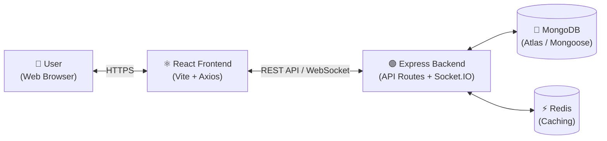

# 🏛 System Architecture

**HopAlong – Travel Companion Platform**

This document describes the overall system architecture, technology stack, folder structure, data flow, and key design decisions for the **HopAlong** application.

---

## 1. High-Level Architecture

HopAlong follows a full-stack client–server architecture using **React** and **Node.js/Express** with **MongoDB**.

```
┌──────────┐  HTTPS   ┌──────────────────┐  REST/WS  ┌───────────────────┐        ┌──────────────┐
│   👤     │ ◄──────► │  ⚛️               │ ◄───────► │  🟢 Node.js       │ ◄────► │  🍃 MongoDB  │
│  User    │          │  React Frontend  │           │  Express Backend  │        │  (Atlas)     │
│ (Browser)│          │  (Vite + Axios)  │           │ (API + Socket.IO) │        └──────────────┘
└──────────┘          └──────────────────┘           └───────────────────┘              ▲
                                                            ▲                          │
                                                            ▼                          │
                                                     ┌───────────────────┐      ┌──────────────┐
                                                     │  ⚡ Redis          │      │ 📧 Nodemailer│
                                                     │  (Cache)          │      │ (Email)      │
                                                     └───────────────────┘      └──────────────┘
```



---

## 2. Technology Stack

Technologies used in the project and their purpose:

| Layer | Technology | Purpose |
|-------|------------|---------|
| Frontend | React 18 (Vite) | UI framework |
| Language | JavaScript (ES6+) | Type-safe, better developer experience |
| Styling | Tailwind CSS | Modern and responsive UI (glassmorphism) |
| Routing | React Router v6 | Client-side navigation & protected routes |
| State | Zustand + localStorage | Lightweight auth/global state with persistence |
| HTTP Client | Axios | API calls with JWT interceptors |
| Real-time | Socket.IO (client + server) | Live chat, typing indicators, notifications |
| Backend | Node.js + Express | Backend logic and API endpoints |
| Database | MongoDB + Mongoose | Data and real-time capabilities |
| Authentication | JWT + bcryptjs | User authentication and authorization |
| Security | Helmet, express-rate-limit, CORS | Headers, throttling, origin control |
| Validation | express-validator | Input sanitization |
| Email | Nodemailer | Transactional email |
| Docs | Swagger UI + Postman | API documentation and testing |
| Deployment | Netlify (FE) / Render (BE) | Hosting and deployment |
| Version Control | Git & GitHub | Source code management |

---

## 3. Folder Structure

The project follows a feature-oriented folder structure to keep the code organized and scalable.

```
HopAlong/
├── frontend/                 # React frontend application
│   ├── src/
│   │   ├── api/              # API client (axios), endpoints, config, socket
│   │   ├── assets/           # Static assets (images, icons)
│   │   ├── components/       # Reusable UI components (Header, TripCard, ChatPanel…)
│   │   ├── hooks/            # Custom React hooks
│   │   ├── lib/              # Utility helpers
│   │   ├── routes/           # Page-level components (Login, Home, TripDetail…)
│   │   ├── store/            # Zustand state management
│   │   ├── App.jsx           # Root component + route definitions
│   │   ├── index.css         # Global styles (Tailwind)
│   │   └── main.jsx          # Application entry point
│   ├── postman/              # 📮 Postman collection — frontend-consumed routes
│   │   └── postman.json
│   └── vite.config.js
│
├── backend/                  # Express backend API
│   ├── config/               # db.js, redis.js, swagger.js, logger.js
│   ├── controllers/          # Request handlers (auth, user, trip, request, message)
│   ├── middleware/           # auth.js, validation.js, errorHandler.js
│   ├── models/               # User.js, Trip.js, JoinRequest.js, Message.js
│   ├── routes/               # auth.js, users.js, trips.js, requests.js, messages.js
│   ├── seeders/              # seedData.js (demo users + trips)
│   ├── utils/                # generateToken.js, emailValidator.js, logger.js
│   ├── server.js             # Express + Socket.IO server entry point
│   └── postman/              # 📮 Postman collection — full backend API routes
│       └── postman.json
│
├── docs/                     # 📚 Project documentation
│   ├── PRD.md                # Product requirements
│   ├── ARCHITECTURE.md       # This document
│   ├── RULES.md              # Development rules & coding standards
│   ├── DESIGN.md             # Design system (colors, typography, components)
│   ├── TASKS.md              # Task breakdown & development plan
│   └── MEMORY.md             # Project memory: context, progress, notes
│
└── package.json              # Workspace scripts (dev, test, lint, build…)
```

---

## 4. Data Flow

1. **Authentication:** User registers/logs in → Backend validates IITR email → bcrypt compare → JWT token issued → Token stored in `localStorage` → Axios interceptor attaches `Authorization: Bearer <token>`.
2. **Trip Browsing:** Frontend fetches trips with filters → Backend queries MongoDB (text index + Redis cache) → Filtered, paginated results returned.
3. **Join Request:** User sends request → Backend validates (no duplicates, seats available, not own trip) → `JoinRequest` created → Organizer notified via Socket.IO.
4. **Approval:** Organizer approves → Participant added to trip → Requester notified via `request:status-update`.
5. **Real-time Chat:** Message sent (REST + Socket.IO) → Broadcast to `trip:{id}` room → All participants receive `message:new` instantly.

---

## 5. Key Design Decisions

| Decision | Rationale |
|----------|-----------|
| IITR email domain enforcement | Trusted, campus-only community |
| JWT in localStorage + Axios interceptor | Simple stateless auth; interceptor auto-attaches tokens and handles 401 logout |
| Socket.IO rooms per trip (`trip:{id}`) | Chat isolation; only approved participants receive messages |
| Rate limiting on `/api/*` | Brute-force and abuse protection |
| Redis caching layer | Faster repeated trip queries |
| Swagger + Postman as source of truth | Every route documented and testable in one click |
